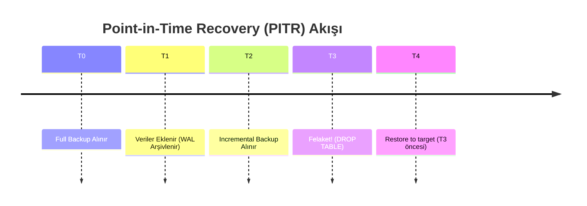
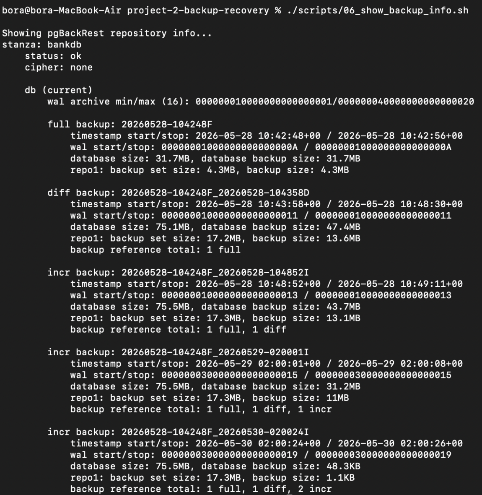
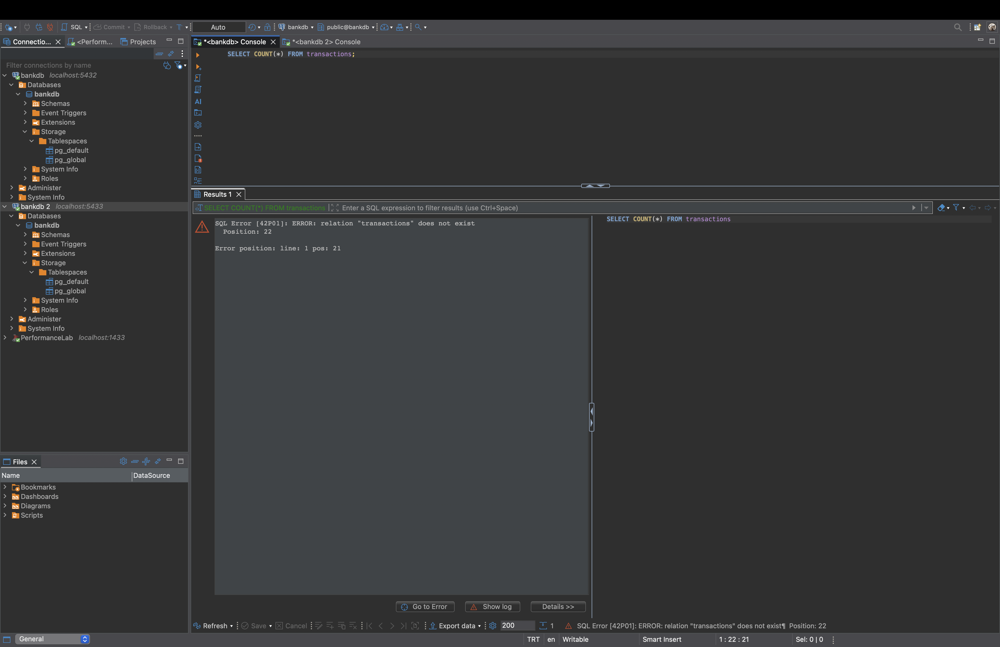
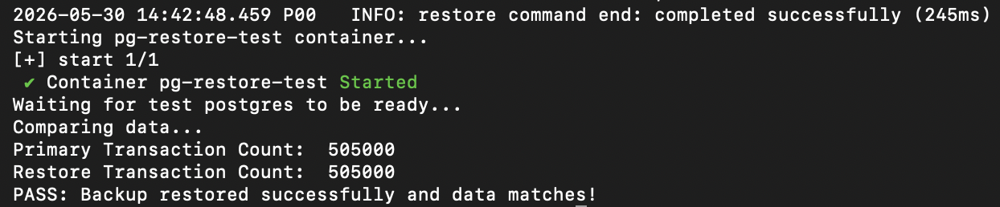
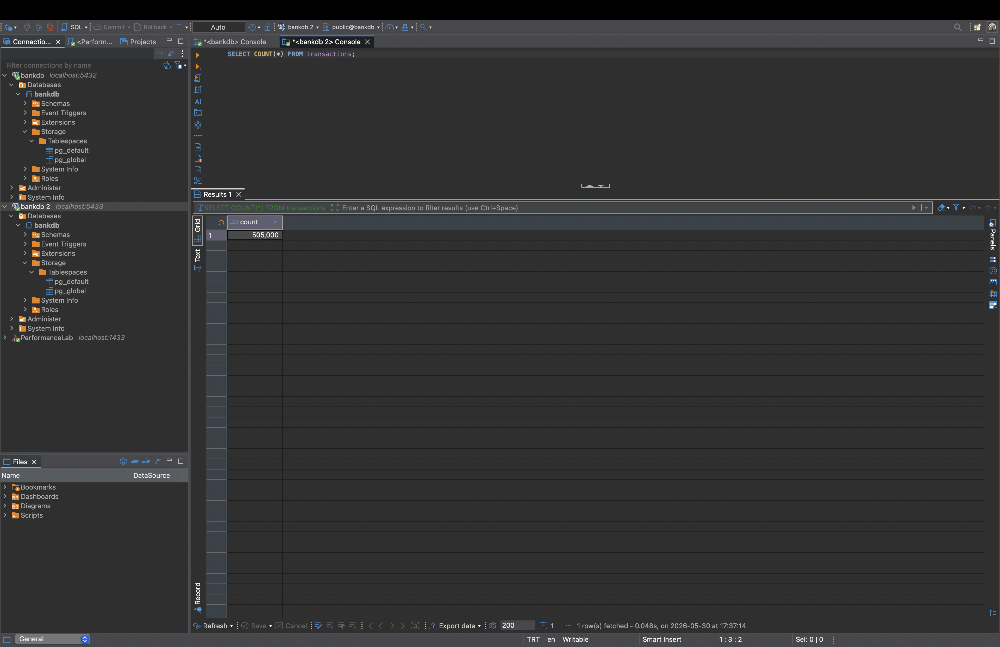

# Proje 2: PostgreSQL Yedekleme ve Felaketten Kurtarma

## Hızlı Başlangıç

> [!TIP]
> Hemen denemek için aşağıdaki komutları kullanarak Docker ortamını saniyeler içinde başlatabilirsiniz.

```bash
cd project-2-backup-recovery
docker compose up -d
```

Sistem ayağa kalktıktan sonra yedek alma, felaket tetikleme ve geri yükleme testlerini yapmak için `scripts/` klasöründeki `.sh` dosyalarını sırayla çalıştırabilirsiniz.
Ayrıca veritabanındaki değişiklikleri izlemek için DBeaver ile `localhost:5432` (Canlı Sistem) ve `localhost:5433` (Kurtarma Testi) portlarına bağlanabilirsiniz.

---


## 1. Projenin Amacı
Bu projenin amacı, geleneksel veritabanı yedekleme yöntemlerinin (örneğin sadece `pg_dump` almak) büyük ve aktif veritabanlarında yetersiz kalabileceğini göstermek ve buna karşılık endüstri standardı olan sürekli arşivleme (WAL - Write-Ahead Logging) tabanlı bir yedekleme altyapısı kurmaktır. Proje kapsamında tam (full), diferansiyel (diff) ve artımlı (incremental) yedekler alınarak, olası veri kaybı senaryolarında (yanlışlıkla veri silinmesi veya tablonun düşürülmesi) istenilen saniyeye (Point-In-Time Recovery - PITR) geri dönüş süreci gerçekleştirilmiştir.




## 2. Kullanılan Platform ve Araçlar
*   **DBMS:** PostgreSQL 16
*   **Yedekleme Aracı:** pgBackRest
*   **Konteynerleştirme:** Docker & Docker Compose
*   **İşletim Sistemi Bağımlılıkları:** Alpine Linux, Bash, Cron (zamanlanmış görevler için)

## 3. Kullanılan Veri Seti / Veritabanı
Sistem, örnek bir bankacılık ve finans veritabanı (`bankdb`) etrafında kurgulanmıştır.
*   **`customers`:** Müşteri bilgileri (Ad, soyad, e-posta, kayıt tarihi).
*   **`accounts`:** Müşterilere ait banka hesapları (IBAN, bakiye, para birimi).
*   **`transactions`:** Hesaplar arası para transferi hareketleri. Bu tabloda test süreçlerini doğrulamak amacıyla sentetik olarak üretilmiş **505.000 satır** veri bulunmaktadır.

## 4. Başlangıç Durumu
Proje başlangıcında sistem sadece standart PostgreSQL imajı kullanıyordu ve herhangi bir felaketten kurtarma planı yoktu. 
*   `02_baseline_pg_dump.sql` ve `00_baseline_pg_dump.sh` komutlarıyla geleneksel `pg_dump` aracılığıyla alınan logların, yedekleme anından sonra gerçekleşen transaction'ları (işlemleri) kapsamadığı ve kritik senaryolarda veri kaybına neden olduğu kanıtlanmıştır.

## 5. Yapılan İşlemler
*   **Docker Ortamının Kurulması:** `pg-primary` adında asıl veritabanını, `pg-restore-test` adında ise yedeklerin sağlamlığını test etmek için kullan-at (ephemeral) bir konteyner ayağa kaldırıldı.
*   **pgBackRest Yapılandırması:** `pgbackrest.conf` ayarlanarak yedek tutma politikaları (retention policy) belirlendi (ör: en az 2 tam, 4 diff yedeği tut). `postgresql.conf` dosyası düzenlenerek WAL arşivleme aktif hale getirildi.
*   **Yedekleme Stratejisi (pgBackRest):**
    | Yedek Tipi | Açıklama |
    |---|---|
    | **Full Backup** | Veritabanının tam kopyası. Geri yüklemenin temelini oluşturur. |
    | **Differential** | Son Full Backup'tan beri değişenler. Hızlı geri yükleme sağlar. |
    | **Incremental** | Son alınan yedekten (Full/Diff/Incr) beri değişenler. Yer kazandırır. |
*   **Felaket Senaryoları (Disasters):**
    *   **Felaket A:** Yanlışlıkla tüm verilerin silinmesi (`DELETE FROM transactions`).
    *   **Felaket B:** Kritik tablonun yapısıyla beraber düşürülmesi (`DROP TABLE transactions`).
*   **Geri Yükleme (PITR):** Her bir felaket anından hemen önceye dönüş (Restore to target) işlemi `04_restore_pitr.sh` scriptiyle yapılarak tüm veriler eksiksiz olarak geri kazanıldı.
*   **Doğrulama:** `05_verify_backup.sh` ile yedek veriler sıfır bir konteynere kurularak asıl veritabanıyla satır sayıları (count) başarıyla karşılaştırıldı.

## 6. Kullanılan SQL Komutları ve Açıklamaları
*   `pg_create_restore_point('nokta_adi')`: Veritabanı transaction loglarında belirli bir isme sahip geri dönüş noktası (bookmark) yaratır. PITR yaparken tam olarak o ana gitmek için kullanılır.
*   `SELECT pg_switch_wal()`: O anki aktif WAL (Write-Ahead Log) dosyasını kapatır ve arşive gönderilmesini zorlar. Acil yedekleme senaryolarında işlemlerin hemen arşive yansıması için tetiklenir.
*   `DELETE FROM transactions`: WHERE koşulu unutulmuş, tüm veriyi silen sorgu (Felaket A).
*   `DROP TABLE transactions`: Tablonun sadece verisini değil, yapısını da tamamen kaldıran SQL komutu (Felaket B).

## 7. Ekran Görüntüleri

**1. Alınan Yedeklerin Listesi (Terminal)**


**2. Felaket Anı - Tablonun Silinmesi (DBeaver)**


**3. Başarılı Geri Yükleme Doğrulaması (Terminal)**


**4. Kurtarılan Verilerin Kontrolü (DBeaver)**


## 8. Elde Edilen Sonuçlar
*   Sistem, standart `pg_dump` yedeklemesinden WAL tabanlı sürekli arşivlemeye başarıyla geçirildi.
*   Kritik veri silinme anlarında dahi hiçbir veri kaybı yaşanmadan veritabanının istenilen zamana sorunsuz dönebildiği PITR işlemiyle kanıtlandı.
*   Kullan-at `pg-restore-test` yapısı sayesinde asıl (production) veritabanı etkilenmeden yedeklerin sağlamlığı otomatik olarak doğrulanabilir hale geldi.

## 9. Karşılaşılan Problemler ve Çözümleri
*   **Sorun:** `05_verify_backup.sh` komutu ile otomatik test yaparken "Read-only file system" hatası alındı.
*   **Çözüm:** Docker Compose volume bağlantısında yedek deposuna sadece okuma (`:ro`) izni verilmişti. Ancak pgBackRest'in doğrulama için bu klasörde geçici dosyalar üretmesi gerektiği için salt-okunur (read-only) kısıtlaması kaldırıldı.
*   **Sorun:** Kurulum sırasında anlık internet kesintisinden kaynaklı `apt-get` paket yöneticisi hata verdi.
*   **Çözüm:** Hata sonrası konteyner mimarisi durdur-başlat senaryosunu güvenli yapacak şekilde izole tasarlandığı için, komut sadece tekrar çalıştırılarak işlem kaldığı yerden başarıyla sürdürüldü.
*   **Sorun:** Geri yüklemede tablo bulunamadı hatası (`relation "transactions" does not exist`).
*   **Çözüm:** Veritabanını geri yüklerken `--target` parametresi belirtilmediği için sistem o an WAL kayıtlarının en sonuna, yani "Tablonun silindiği anın da ilerisine" geri yükleme yaptı. `--target="before_disaster_b"` argümanı eklenerek sorun çözüldü.

## 10. Sonuç ve Değerlendirme
Modern ve aktif sistemlerde veritabanı operasyonlarının en kritik ayaklarından biri olan yedekleme stratejisinin ne kadar önemli olduğu bu projede test edilmiştir. Sadece günlük (daily) yedekleme almanın bir kriz anında yeterli olmayacağı, WAL tabanlı Point-in-Time Recovery yeteneğine sahip `pgBackRest` gibi araçların üretim ortamlarında veri kaybını önlemede temel standart olduğu başarıyla ortaya konulmuştur.

> [!IMPORTANT]
> **Güvenlik ve Optimizasyon Denetimi (Audit)**
> Projenin tüm kodları, çalışabilirlik testleri sonrasında bir denetim sürecinden geçirilmiş olup, tespit edilen yapısal iyileştirmeler `OPTIMIZATIONS.md` dosyasında ayrıca raporlanmıştır. Bu dosya; projeyi test etmek için bilerek zayıf bırakılmış ayarların (örneğin Docker içerisindeki düz metin şifreler, `pg_hba.conf` içerisindeki `trust` ayarları veya eksik veritabanı indeksleri) gerçek bir "production" (canlı) ortama taşınmadan önce nasıl düzeltilmesi ve optimize edilmesi gerektiğini göstermek amacıyla hazırlanmış bir mühendislik farkındalık raporudur.


