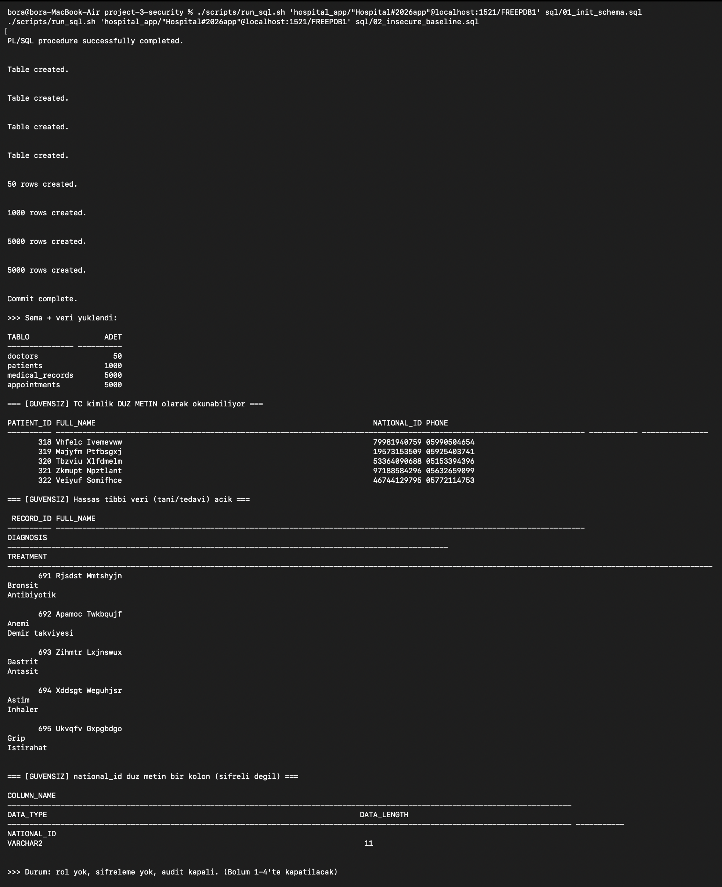
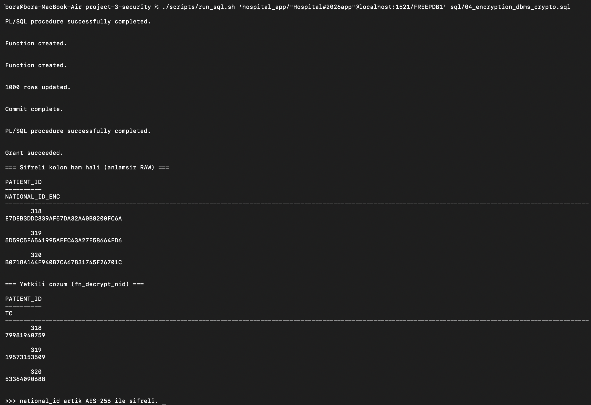
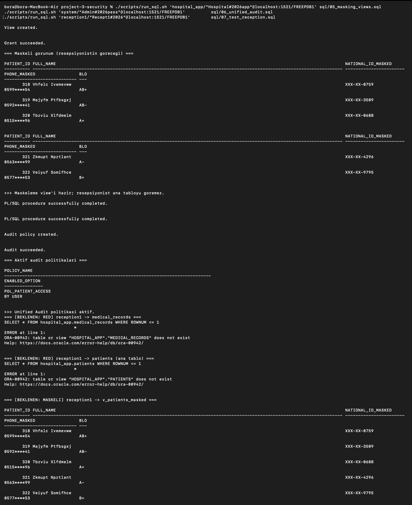
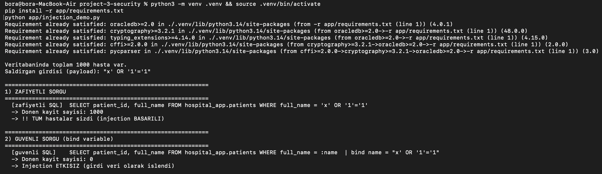
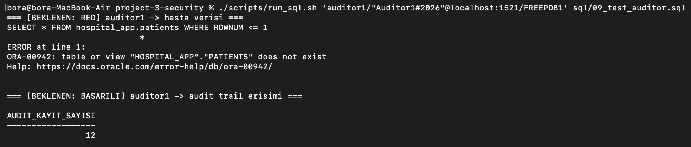
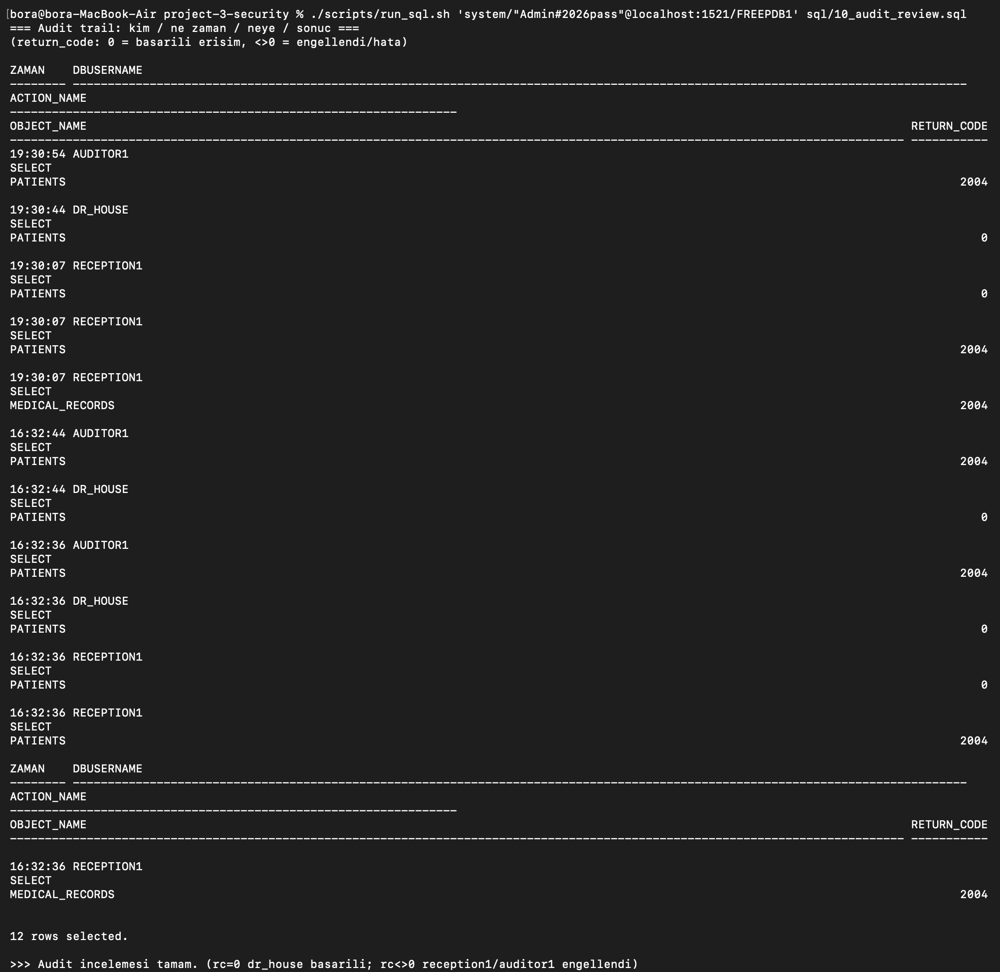

# Proje 3: Veritabanı Güvenliği ve Erişim Kontrolü

## 1. Projenin Amacı
Bu projenin temel amacı, bir "Hastane Bilgi Sistemi" senaryosu üzerinden, hassas verinin (TC kimlik numarası, tanı, tedavi) korumasız tutulduğu **güvensiz bir başlangıç durumundan**, katmanlı güvenlik kontrolleriyle donatılmış **güvenli bir hedef duruma** geçişi somut önce-sonra kanıtlarıyla göstermektir. Dört temel güvenlik ekseni uygulanmıştır: **(1)** rol tabanlı erişim kontrolü (en az yetki prensibi), **(2)** hassas alanın AES-256 ile şifrelenmesi, **(3)** yetkiye göre veri maskeleme, **(4)** SQL Injection'a karşı savunma ve **(5)** tüm hassas erişimlerin denetim (audit) kaydı altına alınması. Her bir kontrol, ilgili kullanıcının ne yapıp ne yapamadığı canlı olarak test edilerek doğrulanmıştır.

## 2. Kullanılan Platform ve Araçlar
- **DBMS:** Oracle Database 23ai Free (Docker Container üzerinden `gvenzl/oracle-free:23-slim` imajı ile çalıştırıldı).
- **Mimari Not:** Geliştirme makinesi Apple Silicon (arm64) olduğu için, x86-only olan ve emülasyonda yavaş/sorunlu çalışan `oracle-xe` (21c) yerine, arm64 üzerinde native çalışan ve daha güncel olan **Oracle 23ai Free** tercih edilmiştir. Tüm işlemler `FREEPDB1` pluggable database'i içinde yürütülmüştür.
- **Güvenlik Bileşenleri:** Roller ve `GRANT`/yetkilendirme, `DBMS_CRYPTO` (AES-256 kolon şifreleme), `VIEW` tabanlı maskeleme, **Unified Auditing** (Oracle'ın modern denetim altyapısı).
- **SQL Injection Demosu:** Python + `python-oracledb` (thin mode — Oracle Client kurulumu gerektirmez).
- **Yönetim Aracı:** `sqlplus` (container içinde, kullanıcı bazlı bağlantılarla).

## 3. Kullanılan Veri Seti / Veritabanı
Dış kaynak yerine, tekrar-üretilebilirlik (reproducibility) adına tüm veri Oracle içinde `CONNECT BY LEVEL` ve `DBMS_RANDOM` ile sentetik olarak üretilmiştir. `hospital_app` şeması altında dört tablo bulunur:
- `doctors`: 50 satır
- `patients`: 1.000 satır — **hassas alanlar:** `national_id` (TC), `phone`, `address`
- `medical_records`: 5.000 satır — **hassas alanlar:** `diagnosis`, `treatment`
- `appointments`: 5.000 satır

Güvenlik projesi olduğu için kritik olan veri hacmi değil, hassas alanların farklı yetki seviyelerinde nasıl korunduğudur.

## 4. Başlangıç Durumu
Başlangıçta sistem kasıtlı olarak güvensiz kurulmuştur (`02_insecure_baseline.sql`):
- **TC kimlik numarası düz metin** olarak saklanıyor ve şemaya erişen herkes tarafından okunabiliyordu (örn. `51038472251`).
- Tanı/tedavi gibi hassas tıbbi veriler hiçbir kısıtlama olmadan açıktı.
- **Rol ayrımı yoktu**, şifreleme yoktu, hiçbir denetim (audit) politikası aktif değildi.
- Uygulama tarafında hasta arama sorgusu, kullanıcı girdisini doğrudan SQL metnine gömen (string birleştirme) **SQL Injection'a açık** bir biçimde yazılmıştı.

## 5. Yapılan İşlemler
- **Rol Tabanlı Erişim Kontrolü:** 4 rol (`doctor_role`, `nurse_role`, `receptionist_role`, `auditor_role`) ve 4 kullanıcı (`dr_house`, `nurse_joy`, `reception1`, `auditor1`) oluşturuldu. Her role yalnızca işini yapması için gereken minimum tablo yetkisi verildi (least privilege).
- **Kolon Şifreleme:** `national_id` kolonu `DBMS_CRYPTO` ile AES-256 (CBC + PKCS5) kullanılarak şifrelendi; düz metin kolon tamamen düşürüldü. Şifre çözme yetkisi (`fn_decrypt_nid`) yalnızca `doctor_role`'e verildi.
- **Veri Maskeleme:** Resepsiyonist gibi düşük yetkili kullanıcıların ana tabloya erişimi tamamen kapatıldı; bunun yerine TC'yi `XXX-XX-1234` formatında, telefonu kısmen gizleyen `v_patients_masked` view'i sunuldu. (Oracle kolon-bazlı SELECT yetkisini desteklemediği için kolon kısıtlaması bu yolla yapıldı.)
- **SQL Injection Savunması:** Aynı kötü niyetli girdi hem zafiyetli (string birleştirme) hem güvenli (bind variable / parametreli sorgu) yöntemle çalıştırılarak fark kanıtlandı.
- **Denetim (Audit):** `patients` ve `medical_records` tablolarına yapılan tüm `SELECT/UPDATE/DELETE` erişimleri Unified Audit politikası ile kayıt altına alındı; başarılı ve engellenen erişimler izlenebilir hale getirildi.

## 6. Kullanılan SQL Komutları ve Açıklamaları
Projedeki tüm kodlar numaralı olarak `sql/` (ve `app/`) klasörü altındadır. Her dosyanın başında hangi kullanıcıyla çalıştırılacağı belirtilmiştir:
- `00_admin_setup.sql` **[SYS as sysdba]**: `hospital_app` şemasına `DBMS_CRYPTO` ve `CREATE VIEW` yetkilerini verir. (Oracle 23ai'de `DBMS_CRYPTO` yetkisi SYSTEM tarafından değil, ancak SYS tarafından verilebilir.)
- `01_init_schema.sql` **[hospital_app]**: Dört tabloyu oluşturur ve sentetik veriyi üretir.
- `02_insecure_baseline.sql` **[hospital_app]**: Güvensiz başlangıç durumunu (düz metin TC, açık tıbbi veri) gösterir — "önce" kanıtı.
- `03_users_and_roles.sql` **[SYSTEM]**: Rolleri, kullanıcıları ve en az yetki prensibine göre tablo yetkilerini tanımlar.
- `04_encryption_dbms_crypto.sql` **[hospital_app]**: `fn_encrypt_nid`/`fn_decrypt_nid` fonksiyonları ile TC'yi AES-256'ya çevirir, düz metin kolonu siler.
- `05_masking_views.sql` **[hospital_app]**: `v_patients_masked` maskeli görünümünü oluşturur ve resepsiyoniste sunar.
- `06_unified_audit.sql` **[SYSTEM]**: `pol_patient_access` denetim politikasını oluşturur ve etkinleştirir.
- `07_test_reception.sql` / `08_test_doctor.sql` / `09_test_auditor.sql` / `10_audit_review.sql`: Her biri **ilgili kullanıcıyla** çalışan, yetkili/engellenen erişimleri ve denetim kayıtlarını gösteren test scriptleridir. (`scripts/run_security_tests.sh` ile sırayla çalıştırılır.)
- `app/injection_demo.py`: SQL Injection'ın zafiyetli ve güvenli versiyonlarını karşılaştıran Python demosu.

> **Çalıştırma yardımcısı:** `scripts/run_sql.sh '<bağlantı>' <dosya>` — bir SQL dosyasını container içindeki `sqlplus`'a doğru kullanıcıyla iletir. Adım adım komutlar için "Hızlı Başlangıç" bölümüne bakınız.

## 7. Ekran Görüntüleri
Önce-sonra güvenlik farkını gösteren en temel görüntüler aşağıda sunulmuştur. Diğer tüm test detaylarına `screenshots/` dizininden ulaşabilirsiniz.

**1. Güvensiz Başlangıç — TC Kimlik Numarası Açık (Düz Metin):**


**2. Şifreleme — Ham (şifreli) hali vs Yetkili Çözüm:**


**3. Maskeleme — Resepsiyonistin Gördüğü Maskeli TC (`XXX-XX-...`):**


**4. SQL Injection — Zafiyetli sorgu (veri sızdırır) vs Güvenli sorgu (engellenir):**


**5. Görev Ayrılığı (Separation of Duties) — Denetçi Hasta Verisini Göremez:**


**6. Denetim (Audit) İzi — Kim, neye, hangi sonuçla erişti:**


## 8. Elde Edilen Sonuçlar
Tüm scriptler, **sıfırdan kurulan temiz bir container üzerinde (0 hata)** uçtan uca doğrulanmıştır. Her güvenlik kontrolünün etkisi aşağıdaki tabloda özetlenmiştir:

| Senaryo | Güvensiz Başlangıç | Güvenli Sonuç | Kanıt |
|---------|--------------------|---------------|-------|
| **Şifreleme** | TC düz metin (`51038472251`) | Diskte AES-256 ciphertext (`688BDFF0482ED4AF...`), düz metin kolon silindi | Yetkili çözüm: `64064285159` |
| **Maskeleme** | Herkes tam TC'yi görüyor | Resepsiyonist yalnızca `XXX-XX-5159`, telefon `0542****13` görüyor | `v_patients_masked` |
| **Erişim Kontrolü** | Tek aşırı yetkili kullanıcı | `reception1` ve `auditor1`, `patients`/`medical_records`'a erişemiyor (`ORA-00942`) | En az yetki prensibi |
| **Görev Ayrılığı** | — | `auditor1` hasta verisini göremiyor ama denetim izini okuyabiliyor | `AUDIT_VIEWER` |
| **SQL Injection** | Zafiyetli sorgu **1000 kaydın tamamını** sızdırdı | Bind variable ile aynı saldırı **0 kayıt** döndürdü | `injection_demo.py` |

**Denetim izinin özeti** (return_code: `0` = başarılı erişim, `2004` = yetki yetersiz/engellendi):

```text
DBUSERNAME     RETURN_CODE    ADET    Anlam
-------------- -----------  ------    ----------------------------
DR_HOUSE                 0       2     Doktor: izinli tam erişim
RECEPTION1               0       1     Resepsiyonist: maskeli view'e izinli
RECEPTION1            2004       2     Resepsiyonist: ana tablolarda engellendi
AUDITOR1             2004       2     Denetçi: hasta verisinde engellendi
```

## 9. Karşılaşılan Problemler ve Çözümleri
1. **`DBMS_CRYPTO` yetki hatası:** Şifreleme yetkisi `SYSTEM` kullanıcısıyla verilmeye çalışıldığında `ORA-00942` alındı. Oracle 23ai'de SYS-paketlerinin yetkisi yalnızca **`SYS as sysdba`** ile verilebildiğinden `00_admin_setup.sql` bu bağlantıyla çalıştırıldı.
2. **TDE yerine `DBMS_CRYPTO`:** Ders dokümanında geçen TDE (Transparent Data Encryption) Oracle Enterprise Edition gerektirir ve Free/XE sürümlerinde bulunmaz. Aynı amaca (hassas alanın diskte korunması) hizmet eden, Free sürümde çalışan **kolon bazlı `DBMS_CRYPTO`** şifrelemesi tercih edildi.
3. **Kolon bazlı SELECT yetkisi yok:** Oracle, `GRANT SELECT (kolon) ...` yapısını desteklemez (kolon bazlı yetki yalnızca INSERT/UPDATE içindir). Belirli kolonları gizlemek için **VIEW** kullanıldı; bu yaklaşım maskeleme ile birleştirildi.
4. **Test bağlantısı güvenilirliği:** Tek `sqlplus` oturumu içinde art arda `CONNECT` yapıldığında default rollerin tutarsız davrandığı (kimi zaman etkinleşmediği) görüldü. Bu nedenle her güvenlik testi **kendi ayrı bağlantısıyla** çalıştırıldı (`run_security_tests.sh`).
5. **Audit flush gereksizliği:** Eski Oracle sürümlerinde gereken `DBMS_AUDIT_MGMT.FLUSH_UNIFIED_AUDIT_TRAIL` çağrısı, 23ai'de hem SYSTEM'e kapalı hem de gereksizdir (kayıtlar anında yazılır); bu nedenle kaldırıldı.

## 10. Sonuç ve Değerlendirme
Veritabanı güvenliğinin tek bir önlemden değil, **katmanlı savunmadan** (defense in depth) oluştuğu kanıtlanmıştır. Şifreleme veriyi diskte/yedekte korurken, maskeleme aynı veriyi yetki seviyesine göre farklı gösterir; rol ayrımı kullanıcının erişim alanını daraltır; bind variable uygulama katmanındaki en yaygın saldırıyı (SQL Injection) etkisiz kılar; denetim ise tüm bu erişimleri geriye dönük izlenebilir yapar. Özellikle "görev ayrılığı" (denetçinin hasta verisini görmeden yalnızca logları okuyabilmesi) gibi prensiplerin, gerçek dünyadaki kurumsal güvenlik politikalarının çekirdeğini oluşturduğu görülmüştür.

---

## Hızlı Başlangıç

```bash
cd project-3-security
docker compose up -d                          # Oracle 23ai Free (FREEPDB1) ayağa kalkar
docker compose ps                             # 'healthy' olana kadar bekle (ilk açılış ~birkaç dk)

# Kurulum scriptleri (sırayla, doğru kullanıcıyla):
./scripts/run_sql.sh 'sys/"Admin#2026pass"@localhost:1521/FREEPDB1 as sysdba'  sql/00_admin_setup.sql
./scripts/run_sql.sh 'hospital_app/"Hospital#2026app"@localhost:1521/FREEPDB1' sql/01_init_schema.sql
./scripts/run_sql.sh 'hospital_app/"Hospital#2026app"@localhost:1521/FREEPDB1' sql/02_insecure_baseline.sql
./scripts/run_sql.sh 'system/"Admin#2026pass"@localhost:1521/FREEPDB1'         sql/03_users_and_roles.sql
./scripts/run_sql.sh 'hospital_app/"Hospital#2026app"@localhost:1521/FREEPDB1' sql/04_encryption_dbms_crypto.sql
./scripts/run_sql.sh 'hospital_app/"Hospital#2026app"@localhost:1521/FREEPDB1' sql/05_masking_views.sql
./scripts/run_sql.sh 'system/"Admin#2026pass"@localhost:1521/FREEPDB1'         sql/06_unified_audit.sql

# Güvenlik testleri (07-10, her test kullanıcı başına ayrı bağlantı):
./scripts/run_security_tests.sh

# SQL Injection demosu:
python3 -m venv .venv && source .venv/bin/activate
pip install -r app/requirements.txt
python app/injection_demo.py
```

### Bağlantı Bilgileri
| Alan | Değer |
|------|-------|
| Servis (PDB) | `localhost:1521/FREEPDB1` |
| Admin | `system` / `Admin#2026pass` (SYS işlemleri için `sys ... as sysdba`) |
| Uygulama şeması | `hospital_app` / `Hospital#2026app` |
| Test kullanıcıları | `dr_house`, `nurse_joy`, `reception1`, `auditor1` |

> Şifreler ders/lab amaçlıdır; gerçek ortamda kullanılmamalıdır.

🎥 **Video:** _(eklenecek)_
