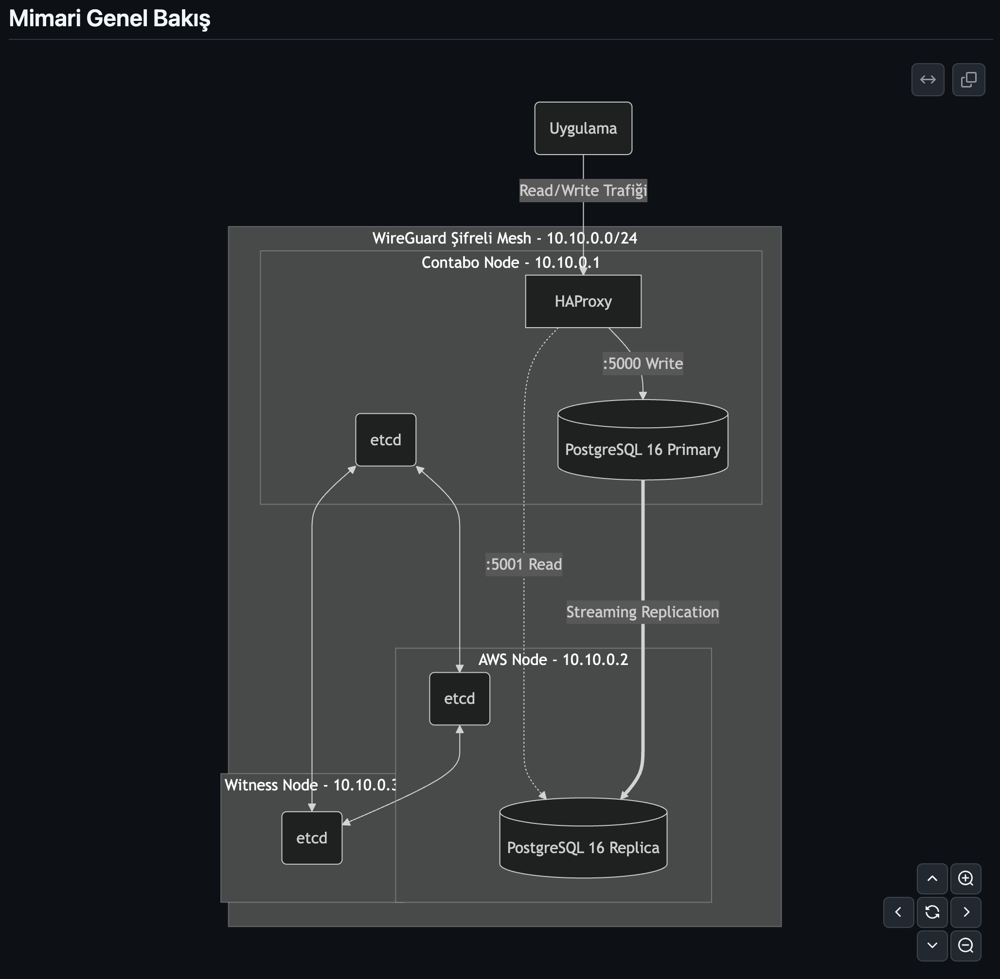
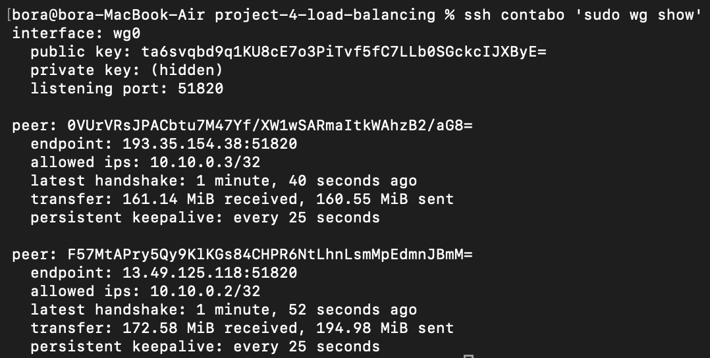
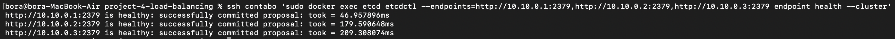
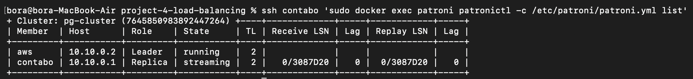
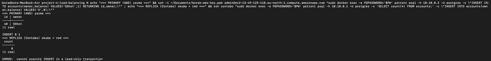
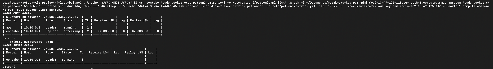
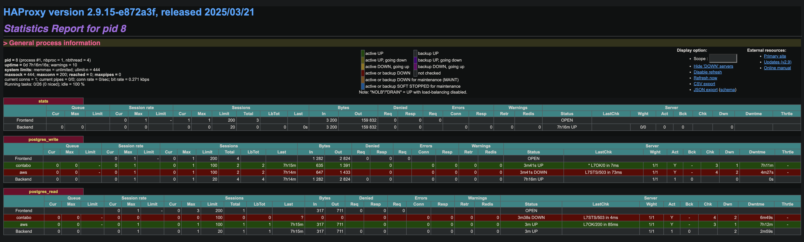

# Proje 4: Veritabanı Yük Dengeleme ve Dağıtık Yapılar

> BLM4522 · Final dönemi projesi · DBMS: **PostgreSQL 16** · Mimari: **gerçek 3-node dağıtık küme**

## Hızlı Başlangıç

Bu proje tek makinede simülasyon değil; coğrafi olarak ayrı **üç gerçek sunucu** üzerinde, WireGuard private mesh üzerinden çalışır. Kurulum bölümler hâlinde ilerler (her node'da ilgili komutlar):

```bash
# 1) WireGuard mesh (10.10.0.0/24) — her node'da /etc/wireguard/wg0.conf
#    Şablon: wireguard/wg0.conf.example  |  Doğrula: wg show + mesh ping
sudo wg-quick up wg0

# 2) etcd 3-node quorum — tek-node "new" → diğerlerini learner ekle → promote
#    Şablon: etcd/run-etcd.sh.example
bash etcd/run-etcd.sh.example contabo 10.10.0.1     # her node kendi adı/IP'siyle

# 3) Patroni + PostgreSQL 16 (yalnızca DB node'larda: Contabo + AWS)
docker build -t patroni-pg16:local patroni/
# /etc/patroni/patroni.yml yerleştir (gerçek DOSYA), sonra:
bash patroni/run-patroni.sh.example

# 4) HAProxy read/write split (Contabo'da)
#    Şablon: haproxy/haproxy.cfg  → :5000 write, :5001 read, :7000 stats

# 5) Doğrulama / testler
bash scripts/04_replication_status.sh   # cluster durumu + lag
bash scripts/03_failover_test.sh        # otomatik failover senaryosu
```

### Küme Bilgileri

| Node | Mesh IP | Sağlayıcı / Donanım | Rol |
|------|---------|---------------------|-----|
| `contabo` | `10.10.0.1` | Contabo · x86 · 8GB · Debian 13 | PostgreSQL + Patroni + etcd + **HAProxy** |
| `aws` | `10.10.0.2` | AWS t4g.small · ARM · 2GB · Debian 13 | PostgreSQL + Patroni + etcd |
| `witness-node` | `10.10.0.3` | mevcut prod sunucu · x86 | **etcd witness** (yalnızca quorum) |

| Erişim Noktası | Adres | Açıklama |
|----------------|-------|----------|
| Yazma (write) | `10.10.0.1:5000` | HAProxy → her zaman **primary** |
| Okuma (read) | `10.10.0.1:5001` | HAProxy → **replica** |
| HAProxy Stats | `10.10.0.1:7000` | İzleme paneli |

> Gerçek IP, WireGuard anahtarları ve veritabanı şifreleri sunucularda + `.secrets/` altında tutulur (git'e girmez). Repo'da yalnızca sırsız `.example` şablonları bulunur.

> **Not:** Tablodaki AWS, Contabo ve witness-node ibareleri; bizim bu projeyi laboratuvar ortamında ayağa kaldırırken kullandığımız özel test sunucularımızdır. Bu projeyi klonlayıp kendi ortamınızda denemek isterseniz, repo içindeki `.example` şablonlarını kullanarak **kendi belirleyeceğiniz herhangi 3 sunucu (veya sanal makine)** üzerinde birebir aynı mimariyi kurabilirsiniz. *(Şablon dosyalarındaki `node1`, `node2` ve `node3` isimleri sırasıyla tablodaki Contabo, AWS ve witness-node sunucularına karşılık gelmektedir.)*

🎥 **Video:** _(eklenecek)_

---

## Mimari Genel Bakış

```
                     WireGuard şifreli mesh — 10.10.0.0/24
                       (mevcut OpenVPN'den tamamen ayrı)
   ┌───────────────────────┬────────────────────────┬───────────────────────┐
   │                       │                        │
┌──────────────────┐  ┌──────────────────┐   ┌────────────────────────┐
│  CONTABO         │  │  AWS (t4g.small) │   │  witness-node             │
│  10.10.0.1       │  │  10.10.0.2       │   │  10.10.0.3             │
│  x86 · 8GB       │  │  ARM · 2GB       │   │  mevcut prod sunucu    │
├──────────────────┤  ├──────────────────┤   ├────────────────────────┤
│ PostgreSQL 16    │◄─►│ PostgreSQL 16    │   │ etcd (WITNESS)         │
│ Patroni · etcd   │  │ Patroni · etcd   │   │ yalnız quorum, ~150MB  │
│ HAProxy          │  │                  │   │ (PostgreSQL YOK)       │
└────────┬─────────┘  └──────────────────┘   └────────────────────────┘
         │  ▲                  ▲
         │  └── streaming replication (primary → replica) ──┘
         │
   uygulama → HAProxy :5000 (write→primary) · :5001 (read→replica) · :7000 (stats)

   Failover: primary çökerse → etcd quorum (kalan DB + witness = 2/3) →
             Patroni kalan düğümü OTOMATİK primary yapar (insan müdahalesi yok).
```

## 1. Projenin Amacı
Bu projenin temel amacı, tek bir veritabanı sunucusuna bağımlılığın (Single Point of Failure) yarattığı riski ortadan kaldıran, coğrafi olarak dağıtık ve **yüksek erişilebilir (HA)** bir PostgreSQL kümesi kurmaktır. Üç farklı sağlayıcıdaki (Contabo, AWS, mevcut prod sunucu) üç gerçek makine, şifreli bir özel ağ (WireGuard mesh) üzerinden birbirine bağlanır. Bu küme üzerinde **(1)** verinin gerçek zamanlı çoğaltılması (streaming replication), **(2)** primary sunucu çöktüğünde insan müdahalesi olmadan yeni bir liderin otomatik seçilmesi (Patroni + etcd failover) ve **(3)** okuma/yazma yükünün uygun düğümlere dağıtılması (HAProxy) somut önce-sonra kanıtlarıyla gösterilmiştir.

## 2. Kullanılan Platform ve Araçlar
- **DBMS:** PostgreSQL 16.14 (Docker container, her DB node'da).
- **HA Orkestrasyonu:** **Patroni 4.1.3** — PostgreSQL'i cluster durumuna göre yöneten, lider seçimi ve failover'ı otomatikleştiren şablon.
- **Dağıtık Konsensüs:** **etcd 3.5.21** — 3 düğümlü quorum; hangi node'un primary olduğuna çoğunluk kararıyla karar verir.
- **Yük Dengeleyici:** **HAProxy 2.9** — Patroni REST sağlık ucunu (`:8008`) sorgulayarak read/write trafiğini doğru düğüme yönlendirir.
- **Özel Ağ:** **WireGuard** — üç sunucu arasında şifreli mesh (`10.10.0.0/24`); hiçbir veritabanı portu public internete açılmaz.
- **Mimari Not:** Düğümler farklı mimaridedir (Contabo x86_64, AWS ARM64). Tüm Docker imajları çok-mimarili (multi-arch) olduğundan her node kendi mimarisinde native çalışır.

## 3. Kullanılan Veri Seti / Veritabanı
Replication ve failover sırasında veri bütünlüğünü kanıtlamak için basit bir `accounts` (banka hesabı) tablosu sentetik olarak üretilmiştir (`sql/00_init_schema.sql`). Bu projede kritik olan veri hacmi değil, **bir düğümde yazılan verinin diğerine anında çoğalması** ve **failover sonrası kaybolmamasıdır.**

## 4. Başlangıç Durumu
HA kurulmadan önceki sorun: **tek sunucu bağımlılığı.** Tek bir PostgreSQL düğümüne bağlı bir uygulamada, o düğüm çökerse hizmet tamamen kesilir; otomatik bir yedek devreye girmez ve veri kaybı riski doğar. Bu projenin tüm kurulumu, bu tek arıza noktasını (SPOF) ortadan kaldırmak için yapılmıştır.

## 5. Yapılan İşlemler
- **WireGuard Mesh:** Üç sunucu arasında `10.10.0.0/24` özel ağı kuruldu (full mesh); tüm küme trafiği (replication, etcd, Patroni) bu şifreli tünelden geçirildi. Mevcut OpenVPN'e dokunulmadı.
- **etcd 3-node Quorum:** Üç düğümde etcd kümesi kuruldu. witness-node yalnızca **witness** (etcd) olarak görev yapar; üzerinde PostgreSQL çalışmaz. Bu sayede bir DB düğümü çökse bile 2/3 çoğunluk korunur.
- **Streaming Replication:** Patroni + PostgreSQL 16 ile Contabo primary, AWS replica olarak yapılandırıldı; veri gerçek zamanlı çoğaltıldı.
- **Otomatik Failover:** Primary durdurulduğunda Patroni'nin etcd quorum'u üzerinden yeni lideri **otomatik** seçtiği doğrulandı.
- **Yük Dengeleme:** HAProxy ile `:5000` yazma trafiğini primary'ye, `:5001` okuma trafiğini replica'ya yönlendiren read/write split kuruldu.

## 6. Kullanılan Komutlar ve Yapılandırma Dosyaları
Tüm yapılandırma ve betikler katman katman repo'da yer alır (gerçek sırlar hariç, `.example` olarak):
- `wireguard/wg0.conf.example` — mesh düğüm yapılandırması (PersistentKeepalive=25, AWS NAT için).
- `etcd/run-etcd.sh.example` — etcd düğüm başlatıcı; mesh IP'lerine bind, port public'e açılmaz.
- `patroni/Dockerfile` — `postgres:16` üzerine Patroni (`USER postgres` ile çalışır).
- `patroni/patroni.yml.example` — düğüm yapılandırması (etcd hosts, REST 8008, `shared_buffers 256MB`, `pg_hba 10.10.0.0/24`).
- `patroni/run-patroni.sh.example` — Patroni container başlatıcı.
- `haproxy/haproxy.cfg` — read/write split (Patroni REST `OPTIONS /primary` ve `/replica` health-check'leri).
- `sql/00_init_schema.sql`, `sql/01_replication_check.sql` — şema + replication doğrulama.
- `scripts/03_failover_test.sh`, `scripts/04_replication_status.sh` — failover ve durum betikleri.

## 7. Ekran Görüntüleri
Dağıtık kümenin çalıştığını ve failover'ın gerçekleştiğini gösteren temel görüntüler aşağıdadır. Diğer tüm detaylar `screenshots/` dizinindedir.

**1. Mimari / Node Diyagramı:**


**2. WireGuard Mesh — Üç Düğüm Arası Şifreli Bağlantı (`wg show`):**


**3. etcd 3-Node Quorum — Sağlık Durumu (3/3 healthy):**


**4. Streaming Replication — `patronictl list` (Leader + Replica, Lag 0):**


**5. Replication Kanıtı — Primary'de yazılan veri Replica'da görünür, Replica read-only:**


**6. Otomatik Failover — Önce (Contabo Leader) → Sonra (AWS otomatik Leader):**


**7. HAProxy — Read/Write Split ve Stats Paneli:**


## 8. Elde Edilen Sonuçlar
Tüm bileşenler **üç gerçek makine üzerinde** uçtan uca doğrulanmıştır.

| Senaryo | Başlangıç (HA Yok) | Sonuç (HA Var) | Kanıt |
|---------|--------------------|----------------|-------|
| **Replication** | Tek kopya, yedek yok | Primary'de yazılan kayıt replica'da **anında** görünür | `accounts` tablosu replica'da Lag 0 |
| **Replica Koruması** | — | Replica'da yazma reddedilir | `cannot execute INSERT in a read-only transaction` |
| **Otomatik Failover** | Primary ölünce hizmet biter | AWS, quorum ile **otomatik** yeni Leader oldu (insan yok) | Timeline 1→2, `updated leader lock during promote` |
| **Yük Dengeleme** | Tek adres, tek node | `:5000` write→primary, `:5001` read→replica | `inet_server_addr()` farkı |
| **HAProxy Adaptasyonu** | — | Failover sonrası `:5000` yeni primary'ye **kendiliğinden** yöneldi | write `→10.10.0.2` (eski: `10.10.0.1`) |
| **Failback** | — | Eski primary geri gelince **replica** olarak katıldı | Timeline 2, Lag 0, veri senkron |

**Failover anının özeti (gerçek test çıktısı):**

```text
ÖNCE:                                    SONRA (primary durduruldu):
+---------+-----------+---------+        +--------+-----------+--------+
| Member  | Host      | Role    |        | Member | Host      | Role   |
+---------+-----------+---------+        +--------+-----------+--------+
| contabo | 10.10.0.1 | Leader  |   -->  | aws    | 10.10.0.2 | Leader |  (TL 1→2, otomatik)
| aws     | 10.10.0.2 | Replica |        +--------+-----------+--------+
+---------+-----------+---------+
```

## 9. Karşılaşılan Problemler ve Çözümleri
1. **UFW, mesh trafiğini engelliyordu:** Contabo'da güvenlik duvarı (varsayılan `deny incoming`) WireGuard tüneli içindeki TCP trafiğini (etcd 2379/2380) düşürüyordu — ICMP ping geçiyor ama TCP filtreleniyordu. Bu, hem etcd peer hatalarının hem de Patroni'nin yanıltıcı hata mesajlarının asıl köküydü. **Çözüm:** `ufw allow in on wg0 from 10.10.0.0/24`.
2. **etcd cluster-version 3.0.0'da takılması:** Üç düğümün eşzamanlı `state=new` bootstrap'ında etcd küme sürümü 3.0'da kalıyor ve Patroni eski API'ye düşüyordu. **Çözüm:** Tek düğümle bootstrap → diğerlerini `learner` olarak ekle → `promote`.
3. **Patroni `initdb` root reddi:** PostgreSQL initdb root kullanıcısıyla çalışmaz. **Çözüm:** Dockerfile'a `USER postgres` + veri volume'üne uygun sahiplik (uid 999).
4. **WireGuard MTU uyumsuzluğu:** AWS düğümünün varsayılan jumbo MTU'su (8921) tünelde TCP paketlerini düşürüyordu. **Çözüm:** `wg0.conf`'a `MTU=1420` (kalıcı).
5. **Bayat etcd anahtarları:** Başarısız bootstrap denemelerinden kalan `/service/pg-cluster/initialize` anahtarı "waiting for leader" döngüsüne sokuyordu. **Çözüm:** `etcdctl del --prefix` + Patroni restart.

## 10. Sonuç ve Değerlendirme
Bu projede, tek sunucu bağımlılığının ortadan kaldırıldığı, gerçek anlamda **dağıtık ve kendi kendini iyileştiren** bir veritabanı mimarisi kuruldu. Primary sunucu çöktüğünde sistemin, üç düğümlü bir konsensüs (etcd quorum) sayesinde insan müdahalesi olmadan saniyeler içinde yeni bir lider seçtiği ve uygulamanın — bağlantı adresini hiç değiştirmeden — kesintisiz çalışmaya devam ettiği kanıtlandı. Özellikle "witness düğümü" yaklaşımının (üçüncü hafif bir düğümün yalnızca oy çokluğu için bulunması), iki düğümlü kurulumların failover yapamama sorununu nasıl çözdüğü pratikte gösterildi. Bu yapı, dersin **"Ağ Tabanlı Paralel Dağıtım Sistemleri"** başlığının çekirdeğini — gerçek makineler arası, gerçek ağ üzerinden dayanıklılık — birebir yansıtmaktadır.
